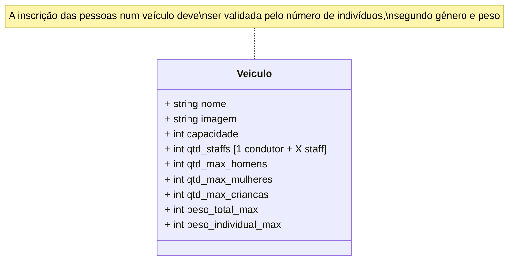
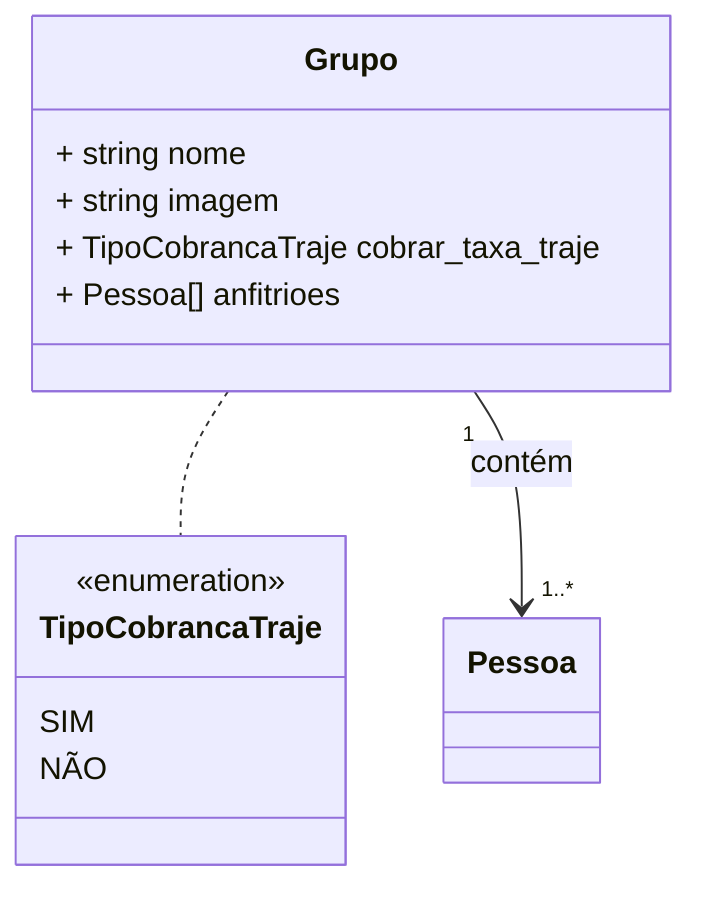
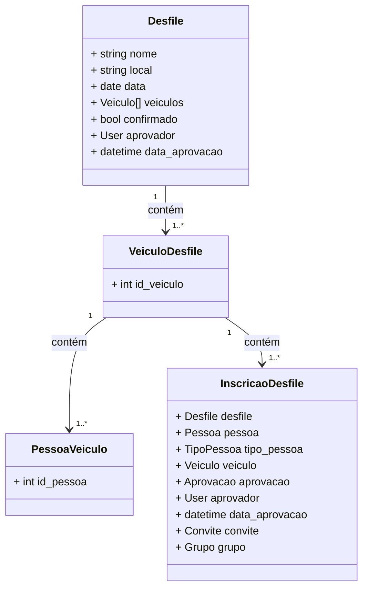
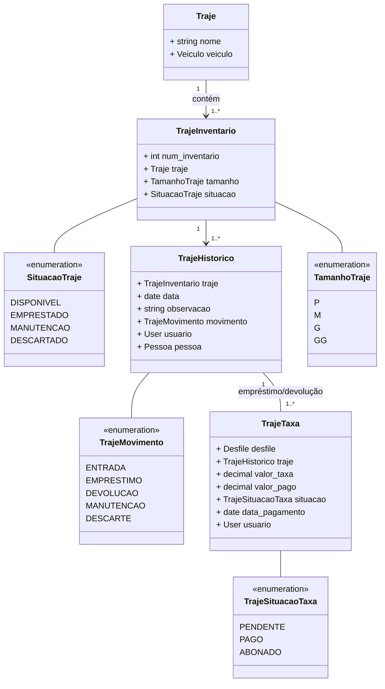
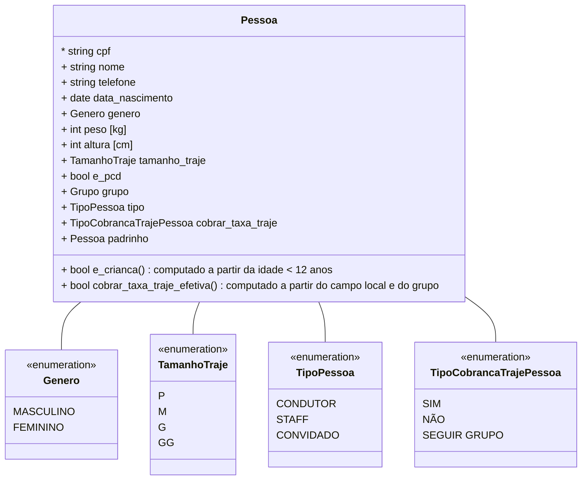

# planetapeia-desfiles

[](https://github.com/guionardo/planetapeia-desfiles/actions/workflows/github-code-scanning/codeql)

Sistema de gestão de desfiles do Planetapéia

## Fluxos dos Usuários Administrativos

Os usuários administrativos acessarão o sistema pela url ```/admin```

### Cadastro de Veículo



### Cadastro de Grupos



### Cadastro de Desfile



### Cadastro de Traje



## Fluxos dos Convidados

### Cadastro pessoal

* Ação para o convidado

O convidado receberá um link, onde poderá inscrever seus dados que serão utilizados em todos os desfiles.

Sua chave de acesso será o CPF, dado obrigatório para evitar duplicação.

O link será gerado por uma pessoa Padrinho/Madrinha de grupo, e incluirá o convidado automaticamente no grupo, após a validação dos dados.

### Inscrição no desfile

## Cadastro Pessoal


